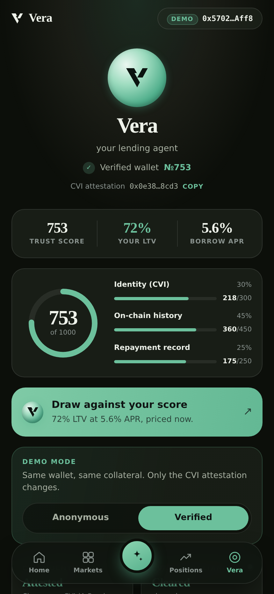
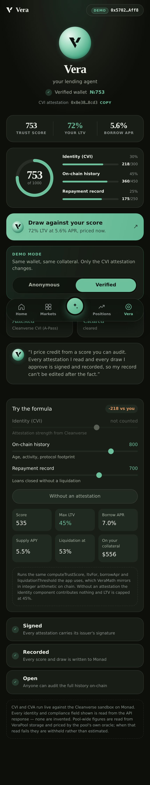
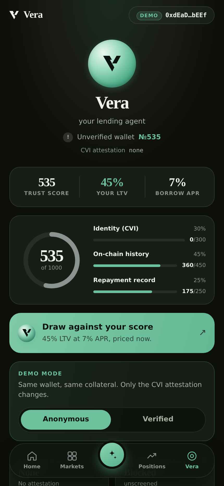
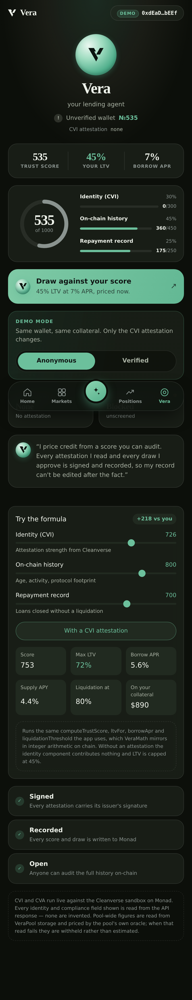
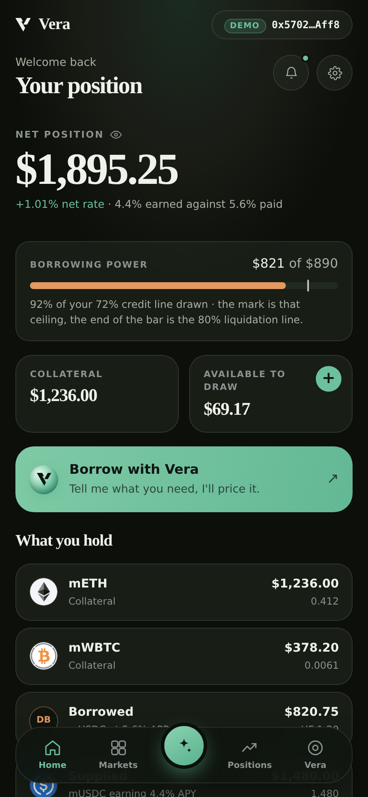
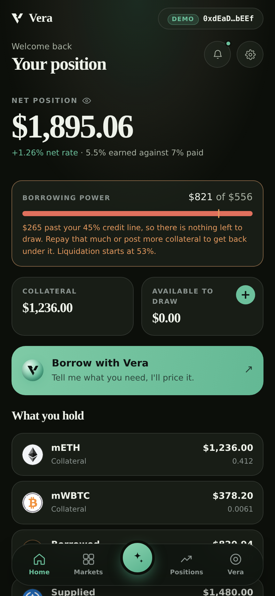
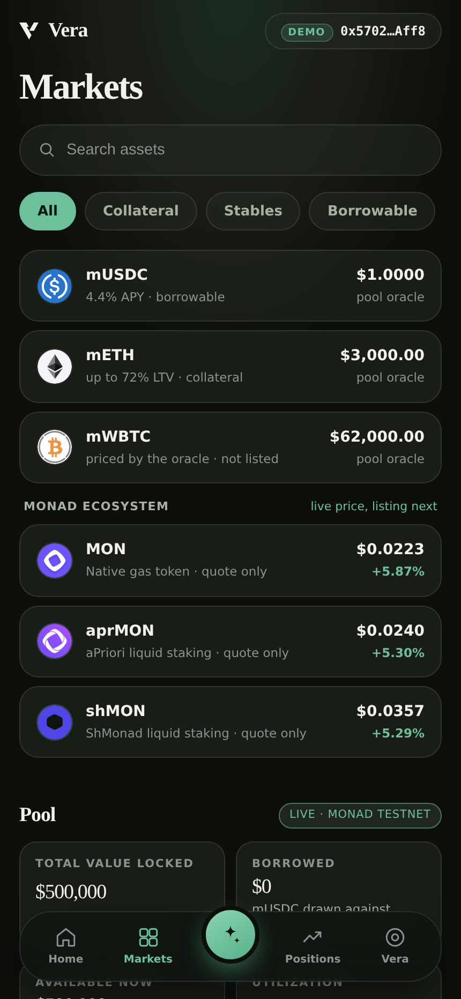
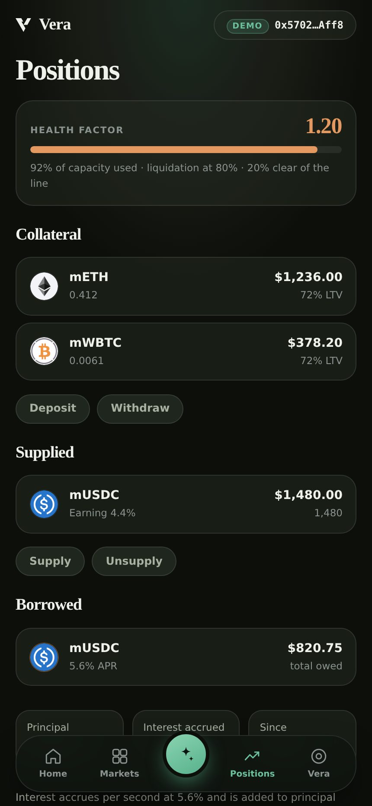

# Vera

**Trust based DeFi lending.** Verified identity and on chain compliance set your
borrowing power, not collateral alone.

**Cleanverse Build: Trusted Assets Hackathon** · DeFi track · sponsored by Monad
Foundation · Team **TheSpiders**

| | |
|:--|:--|
| **Live pool** | Monad testnet, chain ID `10143` |
| **Pool address** | `0x8195157976EbC72fa422391CAb47E71b58623E28` |
| **Repository** | https://github.com/itachi-exe/Vera |
| **Stack** | Solidity (Foundry) · Next.js 16 · React 19 · no external UI kit |
| **Test count** | 138 Solidity · 37 web unit · 36 backend · 5 browser suites |
| **Cleanverse** | CVI and CVA both live against the v5.6 sandbox |


## Contents

1. [The problem](#1-the-problem)
2. [What Vera does](#2-what-vera-does)
3. [The claim, proven on chain](#3-the-claim-proven-on-chain)
4. [Screenshots, screen by screen](#4-screenshots-screen-by-screen)
5. [The math, in full](#5-the-math-in-full)
6. [Cleanverse integration: CVI and CVA](#6-cleanverse-integration-cvi-and-cva)
7. [The contracts](#7-the-contracts)
8. [Architecture](#8-architecture)
9. [Deployed addresses](#9-deployed-addresses)
10. [Security posture](#10-security-posture)
11. [Verification: what is actually proven](#11-verification-what-is-actually-proven)
12. [Running it yourself](#12-running-it-yourself)
13. [What is live and what is not](#13-what-is-live-and-what-is-not)

## 1. The problem

DeFi lending prices every borrower as a stranger. The protocol knows nothing
about who is borrowing, so the only lever it has is collateral. An honest,
verifiable user with a clean repayment record is overcollateralized at the same
45 to 50 percent LTV as a fresh address with no history and no name.

Identity exists on chain today. Lending markets do not read it. So being
verifiable buys a borrower nothing, and the cost of that is paid in capital
efficiency by exactly the users a market should want most.

The mirror problem is compliance. A pool that wants a compliance gate has two
bad options. It bolts on an off chain checkpoint the contract cannot enforce, or
it gates in the UI and leaves the pool open to anyone who calls the contract
directly. Both are theatre.

## 2. What Vera does

Vera reads Cleanverse identity and compliance, turns them into a **trust score**,
and prices credit off that score.

**The score.** Zero to 1000, composed from three inputs with published weights
that sum to one.

| Component | Weight | Source |
|:--|:--:|:--|
| Identity (CVI) | **30%** | live A-Pass: tier, sub tier, freshness, status |
| On chain history | **45%** | wallet age, activity, protocol interactions |
| Repayment record | **25%** | prior borrow and repay behaviour |

**The terms.** The score drives loan to value, liquidation threshold, and borrow
APR on a **continuous curve**, not a tier lookup. One extra point of score is one
step better priced. There are no cliffs to farm.

**Anonymous wallets are not refused.** They are capped at 45 percent LTV and
priced accordingly. Verification is a benefit you earn, not a gate you are
turned away at. Without a CVI attestation the identity component contributes
zero, which is precisely why verifying is worth something.

**The rules exist twice, on purpose.** `vera-frontend/lib/vera.js` quotes terms
in the UI. `vera-contracts/src/VeraMath.sol` enforces them on chain. A parity
suite generates a fixture from the JS library and asserts the Solidity mirror
matches point for point across **all 1001 scores** and **1960 trust score
cases**. Divergence there would mean the pool charging a rate the borrower never
agreed to, so it is a test failure rather than a rounding footnote.

## 3. The claim, proven on chain

The whole thesis reduces to one sentence: **the same collateral should buy more
credit when the borrower is verifiable.** So we proved it rather than asserting
it.

`vera-contracts/script/Demo.s.sol` funds two wallets with **identical**
collateral, identical history inputs, and identical repayment inputs. One holds a
real Cleanverse A-Pass. The other genuinely holds none. The script then reads the
pool state back with `cast` instead of trusting its own console output.

| | Verified | Anonymous | Difference |
|:--|:--:|:--:|:--:|
| **Trust score** | **753** | **535** | +218 |
| Identity (CVI) | 218 / 300 | 0 / 300 | +218 |
| On chain history | 360 / 450 | 360 / 450 | same |
| Repayment record | 175 / 250 | 175 / 250 | same |
| **Loan to value** | **72%** | **45%** (anon cap) | +27 pts |
| Liquidation threshold | 80% | 53% | +27 pts |
| **Borrow APR** | **5.6%** | **7.0%** | 1.4% cheaper |
| Supply APY | 4.4% | 5.5% | |
| **Max borrow on 3 mETH** | **6,480 mUSDC** | **4,050 mUSDC** | **+2,430** |
| Borrow CTA | priced and enabled | blocked by compliance, disabled | |

Read the last row of numbers again. Same nine thousand dollars of collateral.
The verified wallet draws **60 percent more credit** and pays **1.4 percentage
points less** for it. That gap is the product.

These are not two sets of numbers that happen to agree. They are the same
numbers, produced three ways and cross checked:

| Where | How it is produced |
|:--|:--|
| The UI | `lib/vera.js` computes them from the live A-Pass at render time |
| The pool | `VeraMath.sol` recomputes them in integer math on chain |
| The proof | `e2e-cvi-cva.mjs` reads the UI, `cast` reads the pool, both are asserted |

The identity input is **not a constant on the web side at all**. It is computed
from the live A-Pass by `identityScoreFrom()`, so if Cleanverse re-issues the
record the score moves and Vera follows. It already happened once during the
build: the sandbox served tier 20 / subTier 1 on one day and tier 50 / subTier 9
on the next, moving identity from 681 to 726 and the trust score from 739 to 753.
Nothing in Vera changed. Three test suites that had hardcoded 739 failed on
schedule, and were rewritten to derive the expectation from `/api/cvi` at run
time. That is the behaviour you want from a system that claims to read identity
rather than to remember it.

## 4. Screenshots, screen by screen

### 4.1 The landing page

Designed and built from scratch, no component library. Fraunces for display,
Hanken Grotesk for UI, a single mint accent on near black. Section heights match
the design reference within nine pixels, most within two.


### 4.2 The verified wallet

This is the heart of the demo. A wallet holding a live Cleanverse A-Pass. The
score panel shows the composition, not just the number, and the terms panel below
shows exactly what that score bought.



Scrolled out in full: the weight bars, the A-Pass record as Cleanverse actually
returned it, and the compliance chip.



### 4.3 The anonymous wallet

The same screen, the same code path, a wallet with no A-Pass. Identity reads a
locked **0 / 300**. The score falls to 535, LTV is capped at 45 percent, and the
APR rises to 7.0 percent.



Note what is **not** here: no error, no rejection, no dead end. "No A-Pass"
arrives from Cleanverse as business code `0002` on an HTTP 200. It is a state,
not a failure, and Vera renders it as one. The wallet is still offered credit, at
worse terms.



### 4.4 The dashboard, both states

Verified. Borrowing power, health, and the priced borrow action.



Anonymous. Same layout, lower ceiling, and the borrow CTA reads its real reason
for being disabled rather than greying out silently.



### 4.5 Markets

Live pool state read off Monad: supplied liquidity, utilization, and the score
priced rates for the connected wallet.



### 4.6 Positions

Collateral, debt, health factor, and the liquidation price the position would be
called at.



## 5. The math, in full

Nothing here is a black box. Every number on every screen comes from the
functions below, and each has a Solidity twin asserted equal by the parity suite.

### 5.1 Trust score

```
score = round( 0.30 x identity + 0.45 x history + 0.25 x repayment )
```

clamped to `0..1000`, where `identity` is forced to **zero** for a wallet with no
CVI attestation. That single substitution is the entire economic incentive to
verify.

### 5.2 Loan to value

```
earned = round(score x 0.096)
verified   -> clamp(earned, 20, 90)
unverified -> clamp(earned, 20, 45)
```

A verified wallet scales with its score up to a protocol ceiling of 90 percent.
An unverified wallet is capped at 45 percent no matter how good its on chain
history is, because history alone does not tell you who is on the other side.

### 5.3 Liquidation threshold

```
threshold = clamp(ltv + 8, 0, 95)
```

A flat eight point buffer above your LTV. Constant, so a borrower can reason
about it without a calculator.

### 5.4 Borrow APR and supply APY

```
apr = clamp(10.6 - score x 0.00665, 3.5, 12.0)
apy = clamp(apr x 0.79, 1.0, 10.0)
```

Continuous and monotonic. The best possible score pays 3.5 percent, the worst
pays 12 percent, and every point in between moves the price.

### 5.5 Liquidation

```
close factor      = 50%   (a liquidator may clear at most half the debt)
liquidation bonus = 5%    (paid in collateral)
health factor     = collateral USD x (threshold / 100) / debt USD
```

Below a health factor of 1.0 the position is liquidatable. The UI shows the
health factor and the exact collateral price that would trigger it, before you
borrow rather than after.

### 5.6 The Solidity mirror

`VeraMath.sol` cannot use floating point, so every constant is re-expressed in
integer form with explicit rounding:

| JS | Solidity |
|:--|:--|
| `0.30 / 0.45 / 0.25` | `W_IDENTITY = 3000`, `W_HISTORY = 4500`, `W_REPAYMENT = 2500` bps |
| `round(score x 0.096)` | `(score * 96 + 500) / 1000` |
| `10.6 - score x 0.00665` | `milliBps = 1_060_000 - score * 665` |
| `clamp(earned, 20, 45)` | `ANON_LTV_CAP_PCT = 45` |
| `ltv + 8` | `LIQ_BUFFER_PCT = 8` |

The parity suite generates `test/fixtures/rates.json` from the **JS** library and
asserts Solidity reproduces it exactly. Not approximately, not within a
tolerance. Exactly, for every one of the 1001 possible scores.

## 6. Cleanverse integration: CVI and CVA

Every field name and endpoint path came out of the live v5.6 reference at
docs.cleanverse.com, scraped with the access code in `.env`. **None were
guessed.**

### 6.1 CVI, identity, 30 percent of the score

`vera-frontend/app/api/cvi/route.js` calls `POST /query_apass`.

`identityScoreFrom()` derives an identity score from the live record: tier, sub
tier, freshness, and status. `apass.js` weights it to **218 / 300** for the
sandbox record as issued on 2026 08 09.

| Case | Behaviour |
|:--|:--|
| Valid A-Pass | scored on tier, sub tier and freshness |
| **Frozen** A-Pass | scores **zero**, whatever the tier |
| **Expired** A-Pass | scores **zero**, whatever the tier |
| No A-Pass (code `0002`) | `verified: false, score: 0` on a 200, a state and not an error |

A frozen high tier record scoring zero is the case people forget. Vera treats
status as dominant over tier, because a revoked credential that still pays out is
worse than no credential at all.

### 6.2 CVA, compliance, the borrow gate

`vera-frontend/app/api/cva/route.js` runs the attestation layer, plus
`/validator/verify` against the registered pool.

The gate **fails closed**. A failed check, an unrun check, or a stalled upstream
all report `cleared: false`. There is no path where silence reads as a pass.

Critically, **the gate is enforced in `VeraPool.sol` as well**, not only in the
UI. A wallet blocked in the interface cannot route around it by calling the
contract directly. That is the difference between a compliance gate and a
compliance suggestion.

### 6.3 "Could not check" is not "you failed the check"

An early version rendered anything that was not `cleared` as **Blocked**, which
meant an upstream stall accused a compliant wallet of failing compliance. That is
a false accusation produced by a network timeout.

Now only `check-failed` and the not yet loaded state read **Unknown**. Every
other status in `lib/apass.js` is a real determination and still reads
**Blocked**. Note that `unscreened`, meaning no A-Pass exists, **is** a
determination and so is not the empty state.

`e2e-cva-degraded.mjs` proves this under the exact failure it exists for. With
`/api/cva` forced to 502: the chip reads Unknown, the attestation is still
honoured at the live score, and the borrow is still refused. Ten checks, all
passing.

### 6.4 Surviving a slow sandbox

The sandbox does not merely run slow, it intermittently stalls. Measured across
one session: `/query_apass` for a single address took 2.3s, 6.0s and 3.5s on
three consecutive calls, and three of twenty two calls never answered at all.
Because compliance fails closed, every one of those renders as a wallet that
cannot be assessed, which seconds after connecting reads to a user as a broken
app. Three layers sit between that and the screen.

**Retries with a total budget.** Per attempt deadlines of 6s, 8s and 10s under a
20 second ceiling for the whole chain. The first deadline is deliberately the
shortest, because a stalled request does not recover and waiting long before
retrying spends the budget on a call that was never going to answer. The ceiling
exists because a CVA request makes two of these calls back to back.

**A 60 second read cache** over `queryApass` and `verifyCompliance`. Repeat reads
went from about 2.5s to about 11ms on the production build. Two properties matter
more than the speed, and both are pinned by tests:

| Property | Why it matters |
|:--|:--|
| A read that did not complete is never cached | otherwise a timeout poisons the next minute |
| A failure is never answered from an older success | that is the fail closed gate opening on error, the one thing it must not do |

**A freeze does not wait out the TTL.** `status` lives inside the cached record,
so a wallet frozen upstream would otherwise keep its cached `status: 1` for the
rest of the minute. The signed A-Pass webhook calls `invalidateAddress()`, which
drops every entry for that wallet across chains and pools, so the next lookup
goes upstream. The endpoint only ever **forgets**. It cannot raise a score or
clear a wallet, so the worst a forged call achieves is a re-fetch. It is
authenticated anyway: HMAC SHA256 over the raw bytes, compared in constant time,
rejecting unsigned, wrong length and tampered payloads with a 401.

## 7. The contracts

Foundry. `vera-contracts/`.

| Contract | Role |
|:--|:--|
| `VeraPool.sol` | the lending pool: supply, borrow, repay, collateral, liquidation |
| `VeraMath.sol` | credit rules, the integer mirror of `lib/vera.js` |
| `IVeraOracle.sol` | price interface that **must revert**, never return zero |
| `MockOracle.sol` | owner set prices, testnet only |
| `MockERC20.sol` | mUSDC, mETH and mWBTC with an open `mint()` faucet |

**The oracle interface is the interesting one.** It is specified to revert on an
unavailable price rather than return zero. A price oracle that returns zero on
failure values all collateral at nothing, which instantly makes every position
liquidatable at a 5 percent bonus to whoever notices first. Reverting turns a
data outage into a paused pool instead of a bank run. There is a test for it.

**Interest accrual** is per position and lazily applied, with a global accrual so
the pool's totals stay consistent without touching every position. `totalDebtApr`
tracks the debt weighted average rate, so the pool knows what it is earning
across borrowers priced individually.

**Liquidation** clears at most 50 percent of the debt at a 5 percent collateral
bonus. When a liquidation cannot cover the debt, the pool emits the shortfall as
bad debt rather than letting it vanish into the accounting. Hidden bad debt is
how lending protocols die quietly.

## 8. Architecture

```
Vera/
├─ vera-contracts/         Foundry, the protocol itself
│  ├─ src/                 VeraPool, VeraMath, oracle, mocks
│  ├─ test/                138 tests including JS to Solidity parity
│  └─ script/              Deploy, Demo, SignRegistration
├─ vera-backend/           the credentialed tier, the ONLY code with keys
│  └─ src/cleanverse.js    AES-256-CBC, retries, 60s cache, HMAC verify
└─ vera-frontend/          Next.js 16 landing page and app
   ├─ app/api/             cvi + cva route handlers, server only
   ├─ lib/vera.js          protocol math, single source of truth
   └─ scripts/             e2e suites, a11y audit, fixture generator
```

The three halves are wired together in three places, all of them load bearing:

| Direction | Path | Why |
|:--|:--|:--|
| frontend → contracts | `gen-rate-fixtures.mjs` writes `test/fixtures/rates.json` | the parity suite checks Solidity against the rates the UI quotes |
| contracts → frontend | `Deploy.s.sol` writes `public/deployments/<chainid>.json` | served at the exact path `lib/wallet.js` fetches |
| frontend → contracts | `register-pool.mjs` reads `deployments/registration-<chainid>.json` | the EIP-191 signature Foundry produced, posted to `/validator/register` |

**Wallet connection uses EIP-6963.** With several extensions installed
`window.ethereum` holds whichever one won the injection race, so a single
"Connect" button connects an arbitrary wallet. Vera discovers wallets over
EIP-6963 and names them. The listener is registered **before**
`eip6963:requestProvider` is dispatched, because reversing that order misses
every wallet already loaded. One wallet stays one click. The picker appears only
on real ambiguity, and the choice persists.

`e2e-eip6963.mjs` announces two wallets and points `window.ethereum` at the
**wrong** one on purpose, so a cosmetic picker fails the test.

## 9. Deployed addresses

**Monad testnet, chain ID 10143.** Live and verified by reading state back with
`cast`.

| Contract | Address |
|:--|:--|
| **VeraPool** | `0x8195157976EbC72fa422391CAb47E71b58623E28` |
| MockOracle | `0xd3B2B60610AAF874Cf92078fBF156F897C130B4B` |
| mETH (collateral, 18 dec) | `0x0d6510547e521eeC5accf33a039335753433E00c` |
| mUSDC (debt, 6 dec) | `0x3e42243B7f24C4d5aaF5E7e921D08B38eEdDEFa6` |
| mWBTC (extra, 8 dec) | `0xa3A0c4EF06E649106536e91b5e286A28F0704f04` |
| Owner | `0xEF949Bcb07B781450d6d9E339DbB809D378b61F3` |

Live state at time of writing:

| Reading | Value |
|:--|:--|
| Pool bytecode | 19,051 characters, deployed |
| Total supplied | 500,000 mUSDC |
| Total debt | 0 |
| Oracle prices | mETH $3,000 · mWBTC $62,000 · mUSDC $1 |
| Attested demo wallet | `0x5702b24116718DCF49314231222A33403e88Aff8` (tier 50, subTier 9, identity 726) |
| Anonymous demo wallet | `0xdEaD00000000000000000000000000000000bEEf` |

All three mock tokens expose an open `mint()`, so a judge can fund a wallet and
walk the whole flow without asking anyone for tokens.

## 10. Security posture

**Credentials never reach the browser.** `vera-backend/src/cleanverse.js` opens
with `import "server-only"`, so a client side import is a **build failure**
rather than a quiet leak. The browser talks only to Vera's own two route
handlers, never to Cleanverse. Verified by grepping the production bundle for the
live credential values: zero hits, and zero references to the variable names.

**Credentials live in `.env` only.** Never hardcoded, never logged, never in a
screenshot. `.env` is git ignored and a pre commit hook refuses any commit
containing a value from it. `vera-frontend/.env` is a symlink to the root `.env`,
so both halves read one file and credentials are never duplicated.

**A security audit closed seven findings**, each with a regression test and a
mutation check. The audited invariants:

| Invariant | Enforced by |
|:--|:--|
| Oracle failure reverts, never values collateral at zero | `IVeraOracle` contract plus test |
| Reentrancy guard holds across every state changing entry point | `nonReentrant` plus test |
| The compliance gate is enforced on chain, not only in the UI | `VeraPool.borrow` plus test |
| Bad debt is flagged, never hidden | `Liquidated` event plus test |
| The fail closed gate never opens on error | read cache `cacheable` predicate plus test |
| Webhook payloads are authenticated in constant time | HMAC SHA256 plus test |
| Rate limits bound quota spend per client | 20 requests per 60 seconds, per client |

**Mutation checked, not merely green.** Both the contrast detector and the cache
predicate were deliberately broken to confirm the tests catch it. A check that
has never failed is decoration.

**Contract errors are readable.** `POOL_ERRORS` maps twelve named Solidity
custom errors to plain language, so a revert reaches the user as a sentence
rather than a hex selector.

## 11. Verification: what is actually proven

| Suite | Count | Covers |
|:--|:--:|:--|
| Foundry | **138 / 138** | pool mechanics, oracle safety, reentrancy, liquidation, bad debt, and JS to Solidity parity |
| Web unit | **37 / 37** | protocol math, A-Pass interpretation, expiry, compliance verdicts |
| Backend | **36 / 36** | read cache correctness and signed webhook invalidation |
| Wallet e2e | **19 / 19** | connect, disconnect, account and chain change, legacy provider |
| EIP-6963 e2e | **9 / 9** | multi wallet discovery, naming, and picking the right one |
| Degraded CVA e2e | **10 / 10** | behaviour under a forced 502 from the compliance layer |
| CVI · CVA e2e | live | one real attested wallet, one genuinely holding no A-Pass |
| Accessibility | **0 findings** | WCAG AA contrast, accessible names, colour only state, tab order |

Parity fixture coverage: **1001** score cases and **1960** trust score cases,
each asserted equal between JS and Solidity.

The accessibility auditor deserves a note, because naive ones are worthless. It
composites translucent ancestors and scores text against the **worst** stop of a
gradient. A simple sampler reads `background-color` as transparent under a
`linear-gradient`, walks past a solid looking button to the dark page behind it,
and reports roughly 1:1 contrast on text that is actually 7.8:1. Ours does not,
and it was mutation checked to prove it.

The backend suite proves "served from cache" by the **absence of an upstream
request**, counted against a stubbed server, rather than inferring it from a
timing measurement that a fast network would fake.

## 12. Running it yourself

```bash
# contracts
cd vera-contracts
forge test                    # 138 tests

# web
cd vera-frontend
npm install
npm run dev                   # http://localhost:3000
npm test                      # 37 unit + 36 backend checks
npm run e2e                   # browser suites
```

Reach the dev server as **`localhost`**, not `127.0.0.1`. Next 16 blocks cross
origin dev resources by hostname, so hitting it by IP makes every `_next` chunk
403. Hydration never runs and the page sits on "Starting…", which looks exactly
like a product bug and is not one.

For phone testing use `npm run lan`, which builds and serves the **production**
bundle on `0.0.0.0:3100`. The dev bundle is about 3.7 MB across 15 chunks;
production is about 577 KB across 8. Over WiFi the dev bundle takes seconds to
hydrate, and until it does, buttons are rendered but have no handlers attached,
so taps silently do nothing.

## 13. What is live and what is not

We would rather state a gap than paper over one.

| Item | State |
|:--|:--|
| Contracts on Monad testnet | **Live**, chain 10143, state read back with `cast` |
| CVI identity layer | **Live** against the Cleanverse v5.6 sandbox |
| CVA attestation layer | **Live** |
| CVA on chain layer | **Live**, pool registered, `/validator/verify` returns `checked: true, valid: true` |
| `validatorPoolId` written on chain | **Not yet.** Registration is recorded with Cleanverse, and `setValidatorPoolId(bytes32)` exists and is owner gated, but the pool still returns `0x00…0` |
| Landing page and app | **Live**, both wallet states demonstrable |
| Accessibility | Audited, 0 findings |
| Public repository | **Live** at https://github.com/itachi-exe/Vera |

On the one outstanding item: v5.6 returns a **transaction hash** from
`/validator/register` and defines no pool identifier, so the hash is what gets
written as the `bytes32`. `register-pool.mjs` prints the exact `cast send` to
run. The setter is owner only and the function is tested. Nothing is being
claimed as done that is not.

Three demo tokens with open faucets, one live pool, two wallets, and a 2,430
mUSDC difference between them that comes from nothing but identity.

**Team TheSpiders** · Cleanverse Build: Trusted Assets Hackathon · DeFi track

